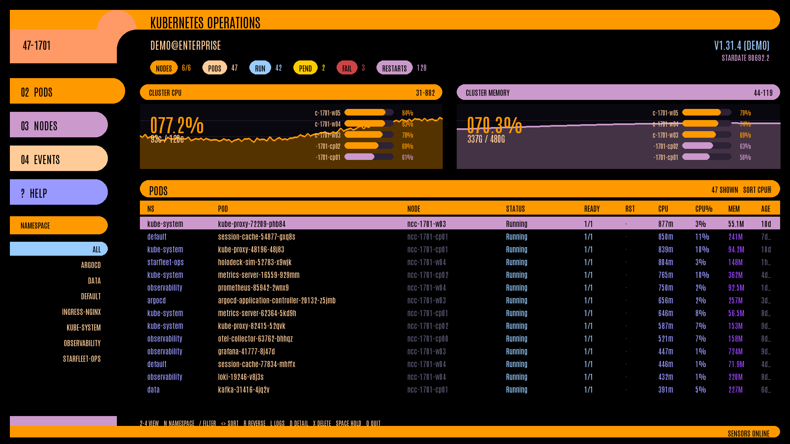

# lcars-k8s

lcars-k8s is a Kubernetes operations dashboard with two interfaces:

- A pixel-rendered LCARS dashboard for a local display
- A responsive Textual terminal interface for SSH, Kmscon, FbTerm, and ordinary terminals

It displays cluster CPU and memory history, node utilization, pods, deployments,
events, container logs, pod details, and Kubernetes manifests. It can also delete a
selected pod after confirmation.



## Requirements

### Supported platform

The installer targets Ubuntu Server 22.04 and 24.04. The application requires:

- Python 3.10 or newer
- Network access to Ubuntu package repositories and PyPI during installation
- `sudo` access when a required Ubuntu package is missing
- A usable kubeconfig for a real cluster, or the included demo data source
- An active local kernel VT for fullscreen graphical mode

The terminal interface also works over SSH. A desktop environment is not
required for fullscreen graphical mode.

### Dependencies installed automatically

Running `./install.sh` installs missing Ubuntu system packages:

- `python3`
- `python3-venv`
- `xinit`
- `xserver-xorg-core`

It then creates a private virtual environment and installs these Python runtime
dependencies from `pyproject.toml`:

- `pygame-ce`
- `textual`
- `kubernetes`

Kmscon and FbTerm are optional terminal hosts. The installer does not install
them.

## Installation

### 1. Enter the project directory

If you downloaded an archive, extract it and enter the directory containing
`install.sh`:

```bash
cd lcars-k8s
```

If necessary, make the installer executable:

```bash
chmod +x install.sh
```

Do not run the entire installer with `sudo`. It uses `sudo` only when it needs
to install a missing Ubuntu package.

### 2. Run the installer

```bash
./install.sh
```

The installer performs these steps:

1. Installs missing Python and Xorg packages with `apt-get`.
2. Verifies that Python 3.10 or newer is available.
3. Creates `~/.local/share/lcars-k8s` as a private virtual environment.
4. Installs lcars-k8s and its Python dependencies into that environment.
5. Creates `~/.local/bin/lcars-k8s` as a symbolic link to the command.

The installer replaces an existing lcars-k8s virtual environment when rerun.
It does not install packages into the system Python environment.

### 3. Ensure the command is on PATH

Ubuntu normally includes `~/.local/bin` after a new login. For the current
shell, use:

```bash
export PATH="$PATH:$HOME/.local/bin"
```

To add it permanently when your shell does not already include it:

```bash
printf '\nexport PATH="$PATH:$HOME/.local/bin"\n' >> "$HOME/.bashrc"
source "$HOME/.bashrc"
```

### 4. Verify the installation

```bash
lcars-k8s --version
lcars-k8s --demo
```

The demo uses a synthetic cluster and does not need Kubernetes credentials.
Press `q` to exit.

### Alternative pipx installation

If Python, pipx, and the required Xorg packages are already installed:

```bash
pipx install .
```

A pipx installation does not install the Xorg system packages. Install them
separately before using fullscreen graphical mode:

```bash
sudo apt-get update
sudo apt-get install -y xinit xserver-xorg-core
```

## Connecting to Kubernetes

### Use the current kubeconfig context

The default command uses the current context from the standard kubeconfig:

```bash
kubectl config current-context
kubectl cluster-info
lcars-k8s
```

The Kubernetes Python client searches the normal kubeconfig location. You can
also set `KUBECONFIG`:

```bash
export KUBECONFIG="$HOME/.kube/config"
lcars-k8s
```

### Select a kubeconfig and context explicitly

```bash
lcars-k8s --kubeconfig /path/to/config --context production
```

Start in one namespace when desired:

```bash
lcars-k8s --namespace kube-system
```

The `n` key cycles through namespaces after startup. The `a` key returns to all
namespaces.

### Required Kubernetes permissions

The active Kubernetes identity needs these permissions:

| API resource | Verbs | Purpose |
|---|---|---|
| nodes | get, list | node status and capacity |
| pods | get, list | pod status, details, and manifests |
| pods/log | get | container logs |
| events | get, list | event view |
| deployments.apps | get, list | deployment readiness and rollout status |
| namespaces | get, list | namespace selection |
| metrics.k8s.io nodes and pods | get, list | live CPU and memory usage |
| pods | delete | optional pod deletion |

Check the important permissions for the current identity:

```bash
kubectl auth can-i list nodes
kubectl auth can-i list pods --all-namespaces
kubectl auth can-i get pods/log --all-namespaces
kubectl auth can-i list events --all-namespaces
kubectl auth can-i list deployments.apps --all-namespaces
kubectl auth can-i list nodes.metrics.k8s.io
kubectl auth can-i delete pods --all-namespaces
```

`rbac.yaml` creates a service account, ClusterRole, and ClusterRoleBinding with
the required permissions:

```bash
kubectl apply -f rbac.yaml
```

For a read-only dashboard, remove `delete` from the pods rule before applying
the manifest. The interface remains usable, but deletion attempts will report a
permission error.

When lcars-k8s runs inside a Kubernetes pod, it automatically uses the pod's
service account if no usable kubeconfig is available. Set the pod spec's
`serviceAccountName` to `lcars-k8s` after applying `rbac.yaml`.

### Metrics Server

Live usage requires Metrics Server. Verify it independently:

```bash
kubectl top nodes
kubectl top pods --all-namespaces
```

If Metrics Server is unavailable, lcars-k8s continues using summed resource
requests. The status area indicates that allocation data is being shown instead
of live usage.

## Running the terminal interface

Run against the current Kubernetes context:

```bash
lcars-k8s
```

Useful examples:

```bash
lcars-k8s --demo
lcars-k8s --context production
lcars-k8s --namespace kube-system
lcars-k8s --interval 5
lcars-k8s --timeout 20
lcars-k8s --view nodes
```

The terminal layout adapts down to 80 columns by 24 rows. A terminal with at
least 120 columns by 40 rows is recommended. For the full palette and braille
graphs, use a terminal with truecolor and a font that contains Unicode braille
and block glyphs.

Over SSH, `screen`, or `tmux`, a suitable environment is:

```bash
export TERM=xterm-256color
lcars-k8s
```

Use `COLORTERM=truecolor` only when the terminal actually supports 24-bit
color.

### Linux virtual console

The Linux virtual console supports only a limited palette and lacks many of the
required glyphs. lcars-k8s detects `TERM=linux` and selects its console palette
and solid graphs automatically.

You can select that mode explicitly:

```bash
lcars-k8s --colors console --glyphs solid
```

Available glyph profiles are:

| Profile | Intended use |
|---|---|
| `braille` | modern terminal with complete Unicode fonts |
| `block` | terminal with block glyphs but no braille support |
| `solid` | Linux virtual console fonts |
| `ascii` | maximum compatibility |
| `auto` | follows the detected color mode |

Color and glyph settings are independent. For example:

```bash
lcars-k8s --colors console --glyphs braille
```

## Running fullscreen graphical mode

The graphical renderer draws a 1920x1080 LCARS composition and scales it to the
active display. Normal fullscreen mode starts a private Xorg server with
`xinit`; it does not require a desktop environment.

### Before launching

1. Log in directly on the machine using a local kernel VT.
2. Stop or leave any Kmscon, desktop compositor, or X server that owns that VT.
3. Confirm that `xinit` and `Xorg` are installed.
4. Run the command in the foreground.

Check the required commands:

```bash
command -v xinit
command -v Xorg
```

Launch with demo data first:

```bash
lcars-k8s --graphics --demo
```

Then connect to the real cluster:

```bash
lcars-k8s --graphics
```

The launcher clears inherited `DISPLAY` and `WAYLAND_DISPLAY` values, selects
SDL's X11 backend, starts Xorg on display `:1`, and binds Xorg to the active VT
when the terminal can be identified.

Do not start fullscreen graphical mode as a background SSH job. Xorg needs an
active local session and control of a local VT.

### Desktop window preview

Under an existing X11 or Wayland desktop session, use windowed mode:

```bash
lcars-k8s --graphics --windowed --demo
```

Specify the initial window size when needed:

```bash
lcars-k8s --graphics --windowed --resolution 1600x900 --demo
```

The resolution must use the `WIDTHxHEIGHT` form.

### Direct KMS diagnostic mode

Raw SDL KMSDRM remains available for hardware diagnostics:

```bash
lcars-k8s --graphics --direct-kms --demo
```

This is not the recommended normal mode. Display and keyboard support depends
on the SDL build, DRM device, active session, and GPU driver. A black screen or
missing keyboard input can leave the process running.

Recover from another shell or SSH session with:

```bash
pgrep -af 'Xorg|xinit|lcarsk8s|lcars-k8s'
pkill -TERM -f '/lcars-k8s/bin/python3 -m lcarsk8s'
```

Inspect the process list before terminating anything so that an unrelated Xorg
session is not stopped.

### Graphical diagnostics

The graphical renderer writes the first completed design frame to:

```text
/tmp/lcars-k8s-live-frame.png
```

Capture startup output for troubleshooting:

```bash
rm -f /tmp/lcars-graphics.log /tmp/lcars-k8s-live-frame.png
lcars-k8s --graphics --demo > /tmp/lcars-graphics.log 2>&1
```

After a failed Xorg launch, inspect:

```bash
cat /tmp/lcars-graphics.log
find "$HOME/.local/share/xorg" /var/log -maxdepth 2 -name 'Xorg*.log' -type f 2>/dev/null
```

The newest Xorg log normally identifies VT ownership, GPU selection, device
permission, display lock, or driver problems.

## Optional Kmscon terminal host

Kmscon provides a local terminal with 256 colors, Pango font rendering, UTF-8,
and KMS/DRM output. Install it separately if desired:

```bash
sudo apt-get update
sudo apt-get install -y kmscon fonts-dejavu-core
```

The supplied configuration selects DejaVu Sans Mono and an LCARS-oriented
256-color palette. Review an existing configuration before replacing it:

```bash
sudo mkdir -p /etc/kmscon
sudo cp kmscon-lcars.conf /etc/kmscon/kmscon.conf
```

Start lcars-k8s from a shell hosted by Kmscon:

```bash
lcars-k8s --kmscon --demo
lcars-k8s --kmscon
```

The `--kmscon` option selects the application's Kmscon display profile. It does
not launch Kmscon itself. Do not set `COLORTERM=truecolor`; Kmscon advertises a
256-color terminal.

Kmscon must release the active display before fullscreen graphical mode starts.

## Optional FbTerm terminal host

FbTerm provides another 256-color local terminal with Freetype font rendering.
Install and start FbTerm separately, then run:

```bash
lcars-k8s --fbterm --demo
lcars-k8s --fbterm
```

The `--fbterm` option sets the correct application profile and `TERM=fbterm`.
It does not launch FbTerm. A useful `~/.fbtermrc` font configuration is:

```ini
font-names=DejaVu Sans Mono
font-size=16
```

Do not set `COLORTERM=truecolor` for FbTerm.

## Keyboard controls

| Key | Action |
|---|---|
| `1` | show or hide cluster graphs |
| `2` | open pods |
| `3` | open nodes |
| `4` | open events |
| `5` | open deployments |
| `Tab` | cycle through views |
| `n` | select the next namespace |
| `a` | show all namespaces |
| `/` or `f` | filter the current view |
| `Esc` | clear or close the current filter or modal |
| `<` or `>` | change the pod sort column |
| `r` | reverse pod sort order |
| arrow keys | move the selected row or scroll a modal |
| `Page Up` or `Page Down` | move through graphical rows in larger steps |
| `Home` or `End` | select the first or last graphical row |
| `l` | open the selected pod's container log |
| `d` | open pod details and manifest |
| `m` | toggle the manifest in the terminal detail modal |
| `c` | select the next container in the terminal log modal |
| `p` | include previous container logs in the terminal log modal |
| `x` or `Delete` | request pod deletion with confirmation |
| `Space` | hold or resume scanning |
| `+` | increase the interval and scan less often |
| `-` | decrease the interval and scan more often |
| `Ctrl+R` | scan immediately |
| `F5` | scan immediately in graphical mode |
| `?` | open help |
| `q` | quit or close the active modal |

Pod deletion requires confirmation with `y` or `Enter`. Use `n`, `Esc`, or `q`
to cancel.

## Command line reference

```text
lcars-k8s [options]
```

| Option | Description |
|---|---|
| `--demo` | use synthetic cluster data |
| `--kubeconfig PATH` | use a specific kubeconfig file |
| `--context NAME` | use a specific kubeconfig context |
| `-n NAME`, `--namespace NAME` | start in one namespace |
| `-i SECONDS`, `--interval SECONDS` | set the scan interval, default 2 seconds, minimum 0.5 |
| `--view pods` or `--view 2` | start in the pods view |
| `--view nodes` or `--view 3` | start in the nodes view |
| `--view events` or `--view 4` | start in the events view |
| `--view deployments` or `--view 5` | start in the deployments view |
| `--timeout SECONDS` | set the API request timeout, default 10 seconds |
| `--graphics` | use the pixel-rendered SDL interface |
| `--windowed` | use a resizable desktop window with graphical mode |
| `--direct-kms` | use SDL KMSDRM instead of the Xorg kiosk |
| `--resolution WIDTHxHEIGHT` | set graphical output resolution |
| `--sidebar left` or `--sidebar right` | place navigation on either side |
| `--kmscon` | use the Kmscon terminal profile |
| `--fbterm` | use the FbTerm terminal profile |
| `--colors auto` | detect the terminal color mode |
| `--colors full` | force the full LCARS palette |
| `--colors console` | force the hand-selected 16-color palette |
| `--glyphs PROFILE` | select `auto`, `braille`, `block`, `solid`, or `ascii` |
| `--version` | print the installed version |
| `-h`, `--help` | show built-in help |

Display modifiers such as `--windowed`, `--direct-kms`, and `--resolution` are
intended to be used with `--graphics`.

## Troubleshooting

### No usable kubeconfig

If the application reports that there is no usable kubeconfig and it is not
running inside a pod:

```bash
kubectl config current-context
kubectl cluster-info
```

Then set `KUBECONFIG` or pass `--kubeconfig` explicitly.

### Permission errors

Use `kubectl auth can-i` with the same context and identity used by lcars-k8s.
Apply `rbac.yaml` only when its cluster-wide service account permissions match
your security requirements.

### Missing metrics

Run `kubectl top nodes`. If that fails, repair or install Metrics Server. The
dashboard remains operational using resource requests.

### Large clusters or slow API responses

Increase the scan interval and request timeout:

```bash
lcars-k8s --interval 10 --timeout 30
```

Start within one namespace if an all-namespace pod list is unnecessarily large:

```bash
lcars-k8s --namespace production
```

### Incorrect colors or replacement glyphs

For the Linux virtual console:

```bash
lcars-k8s --colors console --glyphs solid
```

For an ordinary modern desktop terminal:

```bash
lcars-k8s --colors full --glyphs braille
```

If braille or partial blocks appear as diamonds or empty boxes, use a font with
complete Unicode braille and block coverage, such as DejaVu Sans Mono, or select
`--glyphs solid`.

### Xorg reports an active display

A compositor, Kmscon instance, or stale X server still owns the display or VT.
Switch to an unused local VT or stop only the stale dashboard-related process,
then retry in the foreground.

### Graphical startup stops while creating the SDL surface

Normal graphical mode forces SDL's X11 backend because pygame-ce display
creation can block on some Wayland and wlroots combinations. Confirm that the
normal command is being used and inspect the captured Xorg and application
logs.

## Updating

From an updated source directory, rerun:

```bash
./install.sh
```

The installer replaces the private virtual environment and refreshes the
command link.

## Uninstalling

Remove the command and private virtual environment:

```bash
rm -f "$HOME/.local/bin/lcars-k8s"
rm -rf "$HOME/.local/share/lcars-k8s"
```

The installer does not track ownership of shared Ubuntu packages, so it does
not remove Python or Xorg packages automatically.

## Development checks

Development helpers run the interfaces headlessly:

```bash
python3 dev/graphics_preview.py
python3 dev/graphics_stress.py
python3 dev/preview.py shot 150x42
python3 dev/stress.py
python3 dev/resize.py
```

The terminal PNG preview helper also requires CairoSVG:

```bash
python3 -m pip install cairosvg
```

See `dev/README.md` for helper arguments and expected output.

## Project layout

| Path | Purpose |
|---|---|
| `lcarsk8s/cluster.py` | Kubernetes API and demo data sources |
| `lcarsk8s/graphics.py` | pixel-rendered pygame interface |
| `lcarsk8s/app.py` | Textual application, polling, and actions |
| `lcarsk8s/widgets.py` | terminal dashboard widgets |
| `lcarsk8s/screens.py` | terminal modals for help, logs, details, and deletion |
| `lcarsk8s/palette.py` | LCARS terminal palettes and load gradients |
| `lcarsk8s/glyphs.py` | terminal graphs, meters, elbows, and pills |
| `lcarsk8s/assets/Antonio.ttf` | bundled LCARS display typeface |
| `rbac.yaml` | optional Kubernetes service account and permissions |
| `kmscon-lcars.conf` | optional Kmscon font and palette configuration |
| `install.sh` | Ubuntu dependency and private environment installer |
| `dev/` | headless preview and stress helpers |

The graphical and terminal renderers share the same Kubernetes data layer.

## License

The application is licensed under the MIT License in `LICENSE`. The bundled
Antonio typeface is distributed under the SIL Open Font License in
`lcarsk8s/assets/Antonio-OFL.txt`.
